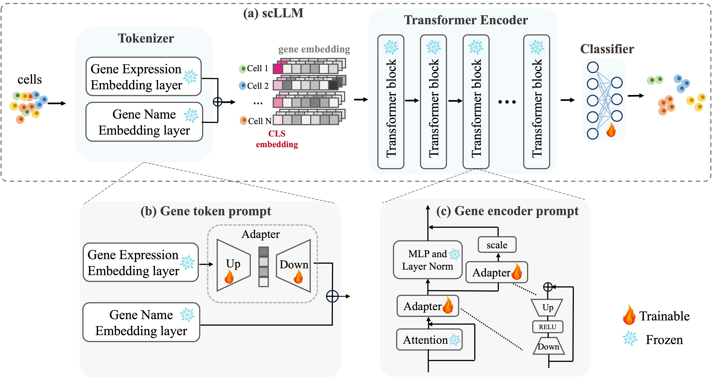

## A Quick Overview


## Requirements
Download model checkpoint: [scGPT_human](https://drive.google.com/drive/folders/1oWh_-ZRdhtoGQ2Fw24HP41FgLoomVo-y) and put it at ./scGPT_human


1. Navigate to the project directory and create a conda environment:
    ```shell
    cd scPEFT
    conda env create -f environment2.yaml
    ```

2. Activate the conda environment:
    ```shell
    conda activate scGPT
    ```

## Data preparation
All data used in this study are publicly available.

brain_cellxgene: https://drive.google.com/drive/folders/1JwKoWlJa85ru0d7TS-VCX8i8MSrt-4Xy 


## Get Started
Firstly，enter folder tutorials  ```cd scPEFT-main/tutorials```

### native 
```
python Tutorial_Reference_Mapping.py --data_name "brain_cellxgene" --model_path "scGPT_human" --subset_train 500 --subset_val 100 --subset_test 100 
```
### full finetune
#### train & test
```
python Tutorial_Annotation_Finetune.py --data_name "brain_cellxgene" --finetune_type "Full_finetune" --load_model "scGPT_human" --use_prompt False --subset_train 500 --subset_val 100 --subset_test 100 
```
### finetune classifier
#### train & test
```
python Tutorial_Annotation_Finetune.py --data_name "brain_cellxgene" --finetune_type "Cls_finetune" --load_model "scGPT_human" --use_prompt False --subset_train 500 --subset_val 100 --subset_test 100 
```
### Gene token prompt
#### train & test
```
python Tutorial_Annotation_Prompt.py --data_name "brain_cellxgene" --prompt_type "Gene_token_prompt" --use_prompt True  --subset_train 500 --subset_val 100 --subset_test 100 
```
### Gene encoder prompt
#### train & test
```
python Tutorial_Annotation_Prompt.py --data_name "brain_cellxgene" --prompt_type "Gene_encoder_prompt" --use_prompt True  --subset_train 500 --subset_val 100 --subset_test 100 
```
### prefix prompt
#### train & test
```
python Tutorial_Annotation_Prompt.py --data_name "brain_cellxgene" --prompt_type "prefix_prompt" --use_prompt True
```
### LoRA prompt
#### train & test
```
python Tutorial_Annotation_Prompt.py --data_name "brain_cellxgene" --prompt_type "LoRA" --use_prompt True
```
## Command Line Arguments
data_name ：dataset name

prompt_type：the type that you add into model

use_prompt：whether use prompt or not

## Result Output Format
```
Weighted Accuracy: XXX, Weighted Precision: XXX, Weighted Recall: XXX, Weighted F1: XXX
-------------------------------------------------------------
                accuracy   precision    recall    f1-score    support
XX cell type         -         -          -          -           -
...
...

              accuracy                               -           -
             macro avg         -          -          -           -
          weighted avg         -          -          -           -
```
Weighted Accuracy: The balanced accuracy in binary and multiclass classification problems to
    deal with imbalanced datasets.

Weighted Precision: weighted Precision based on number of each cell type

Weighted Recall: weighted Recall based on number of each cell type

Weighted F1: weighted F1 score based on number of each cell type


